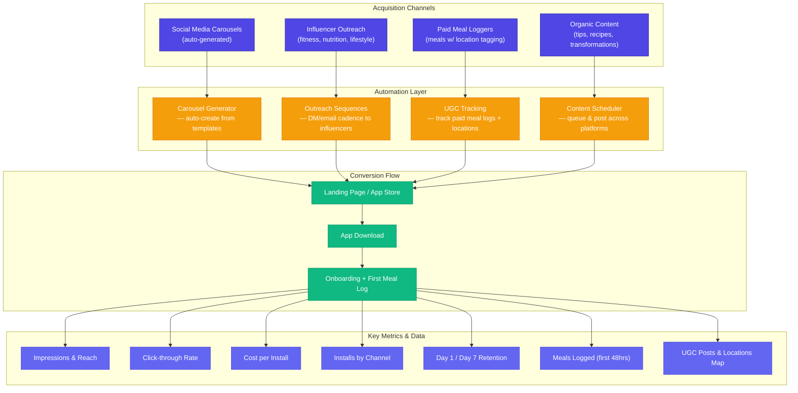

# InstaCal Marketing & Automation Plan

## Overview

Pre-launch and launch marketing system — channels, automation, and metrics.

---

## Marketing Funnel & Automation Flow

---

## Channel Breakdown

### 1. Influencer Outreach

- Target micro-influencers (5k–50k) in fitness/nutrition
- Automated DM/email outreach sequences
- Provide free pro access + affiliate code
- Track installs per influencer

### 2. Paid Meal Loggers (UGC)

- Pay users to log meals with location tagging
- Creates real content + populates the social feed
- Builds location-based discovery data
- Target food-heavy areas (gyms, health cafes, college campuses)

### 3. Auto-Generated Carousels

- Template-based carousel creation from meal data, tips, stats
- Auto-post to Instagram, TikTok, Twitter/X
- A/B test formats and copy

### 4. Organic Content

- Nutrition tips, recipes, transformation stories
- SEO blog posts on the marketing site
- Community highlights from early users

---

## Metrics Dashboard (what we want to see)

| Metric                     | Source                  | Goal                   |
| -------------------------- | ----------------------- | ---------------------- |
| Impressions by channel     | Social APIs             | Track reach per dollar |
| Click-through rate         | UTM links               | >2% from social        |
| Cost per install           | Attribution             | <$2 target             |
| Installs by channel        | App Store + attribution | Know what's working    |
| Day 1 retention            | Analytics               | >60%                   |
| Day 7 retention            | Analytics               | >30%                   |
| Meals logged (first 48hrs) | App data                | >3 per user            |
| UGC posts created          | App data                | Build content flywheel |
| Location coverage map      | App data                | Geographic spread      |
